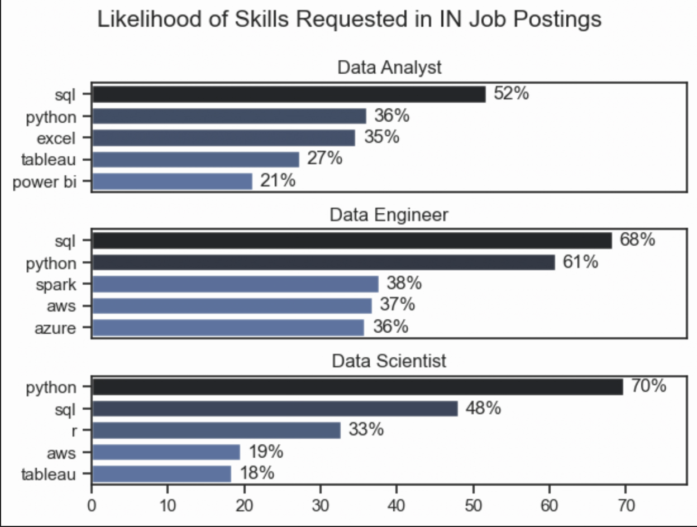
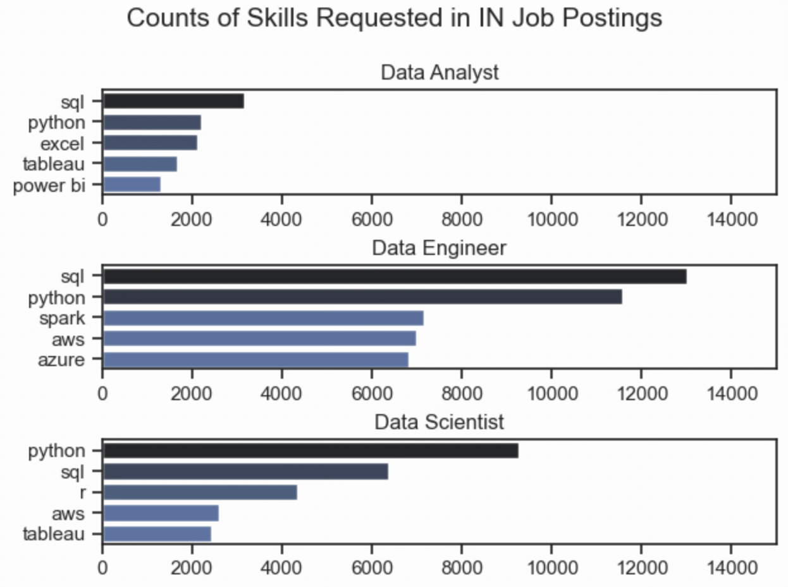
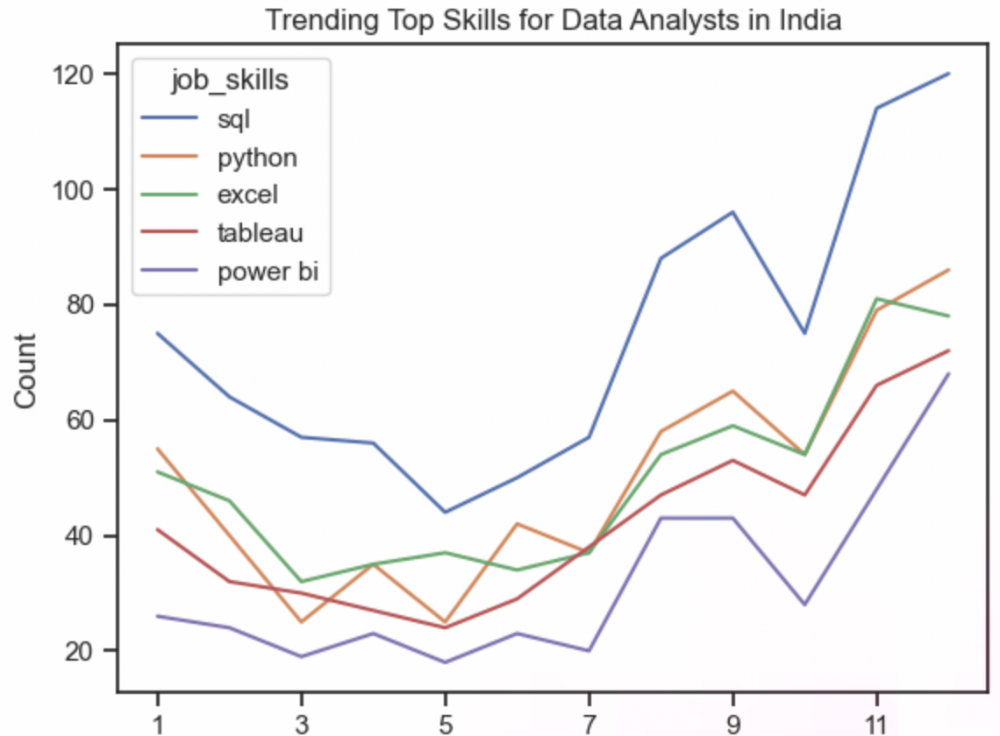
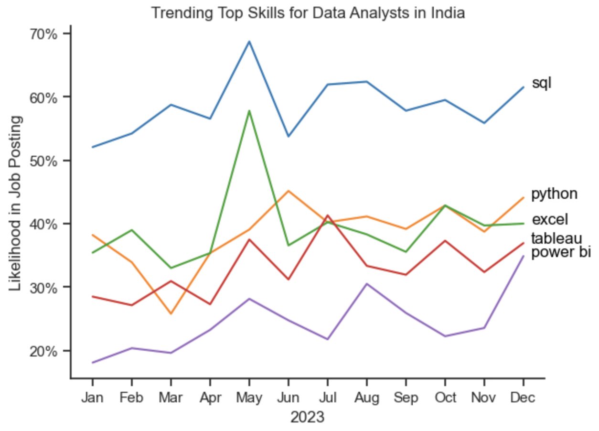

# 1. Most Demanded Skills for Top Data Roles in India

## Overview
This project analyses the most in-demand skills for the top 3 data roles in India's job market, using real-world job posting data. The goal is to identify which skills appear most frequently and what percentage of job postings request them.

## Methodology
1. **Clean skills column** — convert string representations of lists into actual list objects
2. **Explode skills** — expand each skill into its own row for analysis
3. **Count skills** — group by job title and skill, count occurrences
4. **Calculate percentages** — divide skill count by total job postings per role
5. **Visualise** — plot top 5 skills per role as horizontal bar charts using seaborn library.

## Key Findings

### Skill Counts


### Skill Likelihood


| Role | Top Skill | % of Job Postings |
|---|---|---|
| Data Analyst | SQL | 52% |
| Data Engineer | SQL | 68% |
| Data Scientist | Python | 70% |

- **SQL and Python dominate** across all three roles
- **Data Engineers** additionally need cloud skills — Spark (38%), AWS (37%), Azure (36%)
- **Data Analysts** are the only role where Excel (35%) and Power BI (21%) feature prominently
- **Data Scientists** are the only role where R (33%) appears in the top 5

## Libraries Used
```python
import ast
import pandas as pd
import seaborn as sns
import matplotlib.pyplot as plt
from datasets import load_dataset
```

## How to Run
1. Install dependencies:
```bash
pip install pandas matplotlib seaborn datasets
```
2. Open `2_Skill_Demand.ipynb` in Jupyter or VS Code
3. Run all cells in order


# 2. Trend Analysis for In-demand skills in India

## Overview
This project analyzes the monthly demand for various data analytics skills within the data analyst job market in India . By assessing how the likelihood of specific skills appearing in job postings changes over time, this analysis provides insights for data professionals looking to align their skill sets with current market demands in the region .

## Methodology
The analysis was executed through the following structured process:
* **Data Acquisition & Cleaning:** Raw job posting data was retrieved from the Hugging Face `datasets` library via `lukebarousse/data_jobs` . Dates were cast into pandas datetime formats, and stringified skill arrays were securely converted into Python lists utilizing the `ast` library .
* **Data Filtering:** The dataset was filtered to include only postings where the `job_title` matches 'Data Analyst' and the `job_country` is strictly 'India' .
* **Aggregation:** Data entries were grouped by their posting month, and the list of skills was exploded to allocate an individual row to each skill . A pivot table was then generated to aggregate raw monthly frequencies .
* **Normalization:** Raw metrics were normalized into monthly percentages by dividing specific skill occurrences by the aggregate volume of data analyst openings for each respective month .
* **Visualization:** Data trends for the top five skills were plotted longitudinally across 12 months using `matplotlib` and `seaborn` .

## Visualizations
```python

from matplotlib.ticker import PercentFormatter

df_plot = df_DA_US_percent.iloc[:, :5]
sns.lineplot(data=df_plot, dashes=False, legend='full', palette='tab10')

plt.gca().yaxis.set_major_formatter(PercentFormatter(decimals=0))

plt.show()

```
### Counts of Skills Requested


### Skill Percent Trend


## Insights
* **Predominance of SQL:** Structured Query Language (SQL) consistently establishes itself as the primary programmatic prerequisite, appearing in **52% to 69%** of regional job postings over the tracked lifecycle .
* **High Demand for Python and Excel:** Python and Excel contend closely for the secondary position, with Python peaking around **45%** and Excel spiking to nearly **58%** of total listings in specific months .
* **Primary Technical Proficiencies:** The five most frequently demanded skills within the dataset are SQL, Python, Excel, Tableau, and Power BI .
* **Stable Market Requirements:** The underlying demand framework remains highly resilient. Data visualization tools (Tableau and Power BI) maintain strong and consistent inclusion, appearing in **18% to 41%** of job postings .

## Libraries
* `pandas`: Data cleaning, formatting, and mathematical pivoting .
* `matplotlib.pyplot` & `seaborn`: Data visualization, line-chart generation, and axis formatting .
* `datasets`: Remote dataset ingestion from Hugging Face .
* `ast`: Literal string-to-list evaluation .
"""

## How to run
* with open("README_India.md", "w") as f:
    f.write(readme_content_india)


# 3.1. Salary Analysis for Data Jobs in India

## Overview
This project explores the compensation landscape for data professionals in India. It analyzes the salary distributions across common data roles (like Data Scientist, Data Engineer, and Data Analyst) and then deep-dives into Data Analyst roles to identify the highest-paying versus the most in-demand skills.

## 2. Methodology
- **Salary Distribution:** Evaluated the median salaries for the top 6 data job titles in the Indian market to establish a baseline of compensation across different seniority levels and specializations.
- **Skill Pay Analysis:** Narrowed the focus to 'Data Analyst' roles in India, calculating the median salary associated with specific skills.
- **Visualization:** Created box plots to show salary distributions and bar charts to contrast the highest-paid skills against the most in-demand skills. 

Detailed steps and code can be found in the notebook: [4_Salary_Analysis.ipynb](4_Salary_Analysis.ipynb).

## Salary Distributions of Data Jobs

#### Visualize Data 

```python
sns.boxplot(data=df_IN_top6, x='salary_year_avg', y='job_title_short', order=job_order)

plt.title('Salary Distributions of Data Jobs in India')
ticks_x = plt.FuncFormatter(lambda y, pos: f'${int(y/1000)}K')
plt.gca().xaxis.set_major_formatter(ticks_x)
plt.show()

```

### Top data jobs in India
### Salary Distributions


## Insights
* Salary Variation: There's a significant variation in salary ranges across different job titles within the Indian market. Senior roles, such as Senior Data Scientist and Senior Data Engineer, possess the highest salary potential, indicating the immense value placed on advanced technical expertise and industry experience.
* Outliers in Senior Roles: Senior-level positions exhibit a considerable number of outliers on the higher end of the salary spectrum, suggesting that exceptional niche skills or leadership responsibilities can lead to premium compensation. In contrast, standard Data Analyst roles demonstrate a more concentrated consistency in salary with fewer extreme outliers.
* Seniority Scales Pay: Median salaries clearly scale with the seniority and specialization of the roles. Senior positions not only command higher median salaries but also show larger variances in typical compensation bands, reflecting greater pay differentiation as responsibilities increase.


# 3.2. Highest Paid & Most Demanded Skills for Data Analysts

## Overview
Next, I narrowed my analysis and focused only on data analyst roles in India to contrast the skills that pay the highest against the skills that are requested the most.

#### Visualize Data
```python
fig, ax = plt.subplots(2, 1)  

# Top 10 Highest Paid Skills for Data Analysts in India
sns.barplot(data=df_DA_top_pay_IN, x='median', y=df_DA_top_pay_IN.index, hue='median', ax=ax[0], palette='dark:b_r')
ax[0].legend().remove()
ax[0].set_title('Highest Paid Skills for Data Analysts in India')
ax[0].set_ylabel('')
ax[0].set_xlabel('')
ax[0].xaxis.set_major_formatter(plt.FuncFormatter(lambda x, _: f'${int(x/1000)}K'))

# Top 10 Most In-Demand Skills for Data Analysts in India
sns.barplot(data=df_DA_skills_IN, x='median', y=df_DA_skills_IN.index, hue='median', ax=ax[1], palette='light:b')
ax[1].legend().remove()
ax[1].set_title('Most In-Demand Skills for Data Analysts in India')
ax[1].set_ylabel('')
ax[1].set_xlabel('Median Salary (USD)')
ax[1].set_xlim(ax[0].get_xlim())  # Set the same x-axis limits as the first plot
ax[1].xaxis.set_major_formatter(plt.FuncFormatter(lambda x, _: f'${int(x/1000)}K'))

sns.set_theme(style='ticks')
plt.tight_layout()
plt.show()

```

### Highest Paid vs. Most In-Demand Skills


## Insights
* Niche Skills Pay More: The top graph indicates that specialized technical skills and niche tools are strongly associated with higher salaries. This suggests that advanced technical proficiency in specific frameworks can significantly increase earning potential in the region.
* Foundational Skills are Essential: The bottom graph highlights a contrast: foundational skills like SQL, Python, and Excel are the most heavily demanded, even though they do not strictly offer the highest standalone salary premiums. This demonstrates the absolute necessity of these core skills for fundamental employability.
* Strategic Skill Building: There is a clear distinction between the skills that command the highest pay and those that are most frequently requested. Data analysts aiming to maximize their career potential in India should strategically build a diverse skill set that pairs universally demanded foundational competencies with select, high-paying specialized tools.

## Libraties Used
* pandas: For data manipulation and aggregation of salary metrics.
* matplotlib.pyplot & seaborn: For creating box plots and bar charts to visualize salary distributions and skill demands.
* datasets: To load the primary job market dataset from Hugging Face.


# 4. Most Optimal Skills for Data Scientists in India

## Overview
This project analyzes the most optimal skills to learn for Data Scientists in the Indian job market. By plotting the percentage of job postings that require specific skills against their corresponding median salaries, this analysis helps data professionals identify which technologies offer the best balance of market demand and financial reward.

## Methodology
The analysis was executed through the following structured process:
* **Data Acquisition & Cleaning:** Raw job posting data was retrieved from the Hugging Face `datasets` library (`lukebarousse/data_jobs`). Missing salary data was dropped to ensure accurate financial representations.
* **Data Filtering:** The dataset was filtered specifically for 'Data Scientist' roles located in 'India'. 
* **Aggregation:** Data was exploded to allocate an individual row per skill. A pivot operation calculated the median yearly salary and the total occurrence count for each skill.
* **Normalization:** The raw skill counts were divided by the total number of Data Scientist postings (with salary data) to determine the percentage likelihood of each skill being requested.
* **Categorization & Visualization:** Skills with greater than 5% demand were merged with a technology dictionary to categorize them (e.g., Programming, Cloud, Databases). A scatter plot was then generated using `seaborn` and `matplotlib`, utilizing `adjustText` to prevent label overlapping.

## Visualizations

### Optimal Skills Scatter Plot


## 4. Key Findings
* Python and SQL remain the most consistently demanded skills for Data Scientists, although they command a more moderate median salary compared to highly specialized niche technologies.
* Cloud and Big Data tools (such as AWS and Spark) offer significantly higher median salaries, emerging as the most financially optimal skills to learn despite having a lower overall demand frequency than foundational languages.
* Both Excel and Tableau show relatively stable demand as essential supplementary tools but remain on the lower end of the median salary spectrum. Specialized machine learning libraries, while less demanded compared to the core languages, show a distinct upward trend in earning potential.

## 5. Libraries
* `pandas`: Data cleaning, formatting, and mathematical aggregations.
* `matplotlib.pyplot` & `seaborn`: Data visualization, scatter plot generation, and axis formatting.
* `adjustText`: Advanced text label manipulation to prevent overlapping annotations on the scatter plot.
* `datasets`: Remote dataset ingestion from Hugging Face.
* `ast`: Literal string-to-list evaluation.